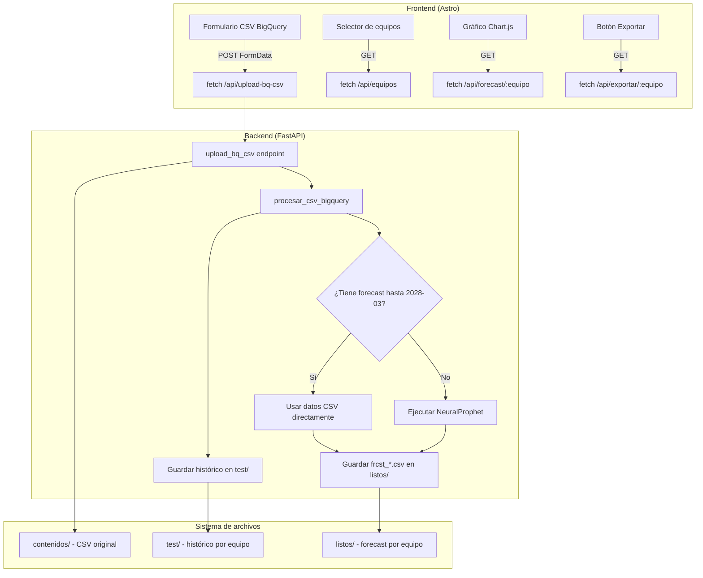

# Design Document: CSV Import Forecast

## Overview

Esta funcionalidad permite importar archivos CSV exportados desde BigQuery al sistema Forecaster. El flujo cubre desde la carga del archivo en el frontend, la validación y mapeo de columnas en el backend, el procesamiento condicional con NeuralProphet (solo si faltan proyecciones), la generación de archivos individuales por equipo, hasta la exportación final en formato Excel.

La arquitectura existente sigue un patrón cliente-servidor simple:
- **Frontend** (Astro + vanilla JS): formulario de carga, selector de equipos, gráfico Chart.js con edición drag-and-drop
- **Backend** (FastAPI): endpoint REST que recibe el CSV, procesa los datos y genera archivos de forecast
- **Motor de forecast** (NeuralProphet): genera proyecciones mensuales cuando el CSV no las incluye hasta la fecha límite

### Decisiones de diseño clave

1. **Procesamiento condicional**: Si el CSV ya contiene proyecciones hasta 2028-03, se usan directamente sin ejecutar NeuralProphet, ahorrando tiempo de cómputo.
2. **Archivos individuales por equipo**: Cada equipo genera su propio CSV de forecast (`frcst_*.csv`), permitiendo edición y visualización independiente.
3. **Rol proporcionado por el usuario**: El Rol no viene en el CSV de BigQuery, el usuario lo ingresa manualmente en el formulario.
4. **Reutilización del pipeline existente**: Los equipos importados desde CSV se integran al mismo flujo de visualización, edición y exportación que los equipos importados desde Excel.

## Architecture



### Flujo de datos

1. El usuario selecciona un archivo `.csv` e ingresa un Rol en el formulario
2. El frontend envía el archivo y el Rol como `FormData` al endpoint `/api/upload-bq-csv`
3. El backend guarda el CSV en `contenidos/`, valida columnas y mapea al formato interno
4. Para cada equipo en el CSV:
   - Guarda datos históricos en `test/{equipo}_{rol}_MAXIMO.csv`
   - Si ya tiene proyecciones completas → usa datos del CSV
   - Si no → ejecuta NeuralProphet para generar proyecciones
   - Guarda resultado en `listos/frcst_{equipo}_{rol}_MAXIMO.csv`
5. Retorna lista de equipos procesados y errores
6. El frontend recarga la lista de equipos y muestra feedback

## Components and Interfaces

### Frontend Components

#### Formulario CSV BigQuery (`bqUploadForm`)
- **Input file** (`bqFileInput`): acepta solo `.csv`
- **Input text** (`bqRolInput`): campo para el Rol, placeholder "Rol (ej: CDN, CORE)"
- **Button** (`bqUploadBtn`): dispara la subida
- **Status** (`bqUploadStatus`): muestra mensajes de estado/error

#### Validación client-side
```javascript
// Validación de Rol antes de enviar
const rol = bqRolInput.value.trim();
if (!rol) {
    bqUploadStatus.textContent = '⚠️ Ingresá un Rol antes de subir.';
    bqRolInput.focus();
    return;
}
```

### Backend Interfaces

#### Endpoint: `POST /api/upload-bq-csv`

**Request:**
- Content-Type: `multipart/form-data`
- Fields:
  - `file`: archivo CSV (UploadFile)
  - `rol`: string con el Rol (Form field, default "CDN")

**Response exitosa (200):**
```json
{
    "message": "CSV 'archivo.csv' procesado. 5 equipo(s) cargados.",
    "equipos": ["equipo1_CDN_MAXIMO", "equipo2_CDN_MAXIMO"],
    "errores": [{"equipo": "equipo3_CDN_MAXIMO", "motivo": "Solo 3 datos (mínimo 6)"}]
}
```

**Response error (400):**
```json
{
    "error": "Faltan columnas: id_enlace, time_series_type"
}
```

#### Función: `procesar_csv_bigquery(ruta_csv, rol, carpeta_test, carpeta_listos, fecha_limite)`

**Parámetros:**
| Parámetro | Tipo | Descripción |
|-----------|------|-------------|
| `ruta_csv` | str | Ruta al archivo CSV guardado |
| `rol` | str | Rol ingresado por el usuario |
| `carpeta_test` | str | Directorio para archivos históricos |
| `carpeta_listos` | str | Directorio para archivos de forecast |
| `fecha_limite` | str | Fecha límite de proyección (default "2028-03-01") |

**Retorno:**
```python
{
    "equipos": List[str],      # Equipos procesados exitosamente
    "errores": List[dict],     # [{"equipo": str, "motivo": str}]
}
```

### Endpoint: `GET /api/exportar/{equipo}`

Genera un Excel `.xlsx` con formato estándar. Detecta si el origen fue CSV BigQuery (no hay `.xlsx` en `contenidos/`) y genera el archivo desde cero con las columnas: Equipo, Rol, Metrica, Capa, Fecha, Valor, Intervalo Menor, Intervalo Mayor.

## Data Models

### CSV BigQuery (entrada)

| Columna | Tipo | Mapeo interno |
|---------|------|---------------|
| `id_enlace` | string | → Equipo (trim espacios, reemplazar espacios por `_`, `/` por `-`) |
| `time_series_timestamp` | datetime | → Fecha (formato YYYY-MM-DD) |
| `time_series_type` | string | → Capa (`history` → "HISTORICO MEDICION", `forecast` → "PROYECCION ACTUAL") |
| `time_series_adjusted_data` | numeric | → Valor (float) |

### Archivo histórico (`test/{equipo}_{rol}_MAXIMO.csv`)

| Columna | Tipo | Descripción |
|---------|------|-------------|
| `ds` | string (YYYY-MM-DD) | Fecha del dato |
| `y` | float | Valor numérico |

### Archivo forecast (`listos/frcst_{equipo}_{rol}_MAXIMO.csv`)

| Columna | Tipo | Descripción |
|---------|------|-------------|
| `ds` | string (YYYY-MM-DD) | Fecha |
| `y` | float | Valor (histórico o proyectado) |
| `tipo` | string | `historico` o `forecast` |

### Nombre clave del equipo

Formato: `{equipo_safe}_{rol}_MAXIMO`

Donde `equipo_safe` = `id_enlace` con:
- Espacios → `_`
- Barras `/` → `-`
- Trim de espacios al inicio/final

### Excel de exportación (`forecast_{equipo}.xlsx`)

| Columna | Tipo | Reglas |
|---------|------|--------|
| Equipo | string | Nombre del equipo (con espacios restaurados) |
| Rol | string | Rol proporcionado por el usuario |
| Metrica | string | Siempre "MAXIMO" |
| Capa | string | "HISTORICO MEDICION" o "PROYECCION ACTUAL" |
| Fecha | datetime | Fecha del dato |
| Valor | float | Valor redondeado a 2 decimales |
| Intervalo Menor | float/vacío | Valor × 0.9 (o × 0.8 si hay outliers) para forecast; vacío para histórico |
| Intervalo Mayor | float/vacío | Valor × 1.1 (o × 1.2 si hay outliers) para forecast; vacío para histórico |

## Correctness Properties

*A property is a characteristic or behavior that should hold true across all valid executions of a system — essentially, a formal statement about what the system should do. Properties serve as the bridge between human-readable specifications and machine-verifiable correctness guarantees.*

### Property 1: Whitespace Rol rejection

*For any* string composed entirely of whitespace characters (spaces, tabs, newlines) or the empty string, attempting to submit the CSV upload form should be rejected without sending a request to the server, and the status message should display the warning.

**Validates: Requirements 1.3**

### Property 2: Column validation reports missing columns

*For any* CSV file where one or more of the required columns (`id_enlace`, `time_series_timestamp`, `time_series_type`, `time_series_adjusted_data`) are absent, the backend should return an error that lists exactly the set of missing columns.

**Validates: Requirements 2.1, 2.2**

### Property 3: Column mapping preserves data correctly

*For any* valid CSV row, the mapping should satisfy:
- `Equipo` equals `id_enlace` with leading/trailing whitespace removed and spaces replaced by `_`, slashes by `-`
- `Fecha` equals `time_series_timestamp` converted to `YYYY-MM-DD` format (or null if unparseable)
- `Valor` equals `time_series_adjusted_data` converted to float (or null if non-numeric)

**Validates: Requirements 2.3, 2.4, 2.5**

### Property 4: Extra columns do not affect processing

*For any* valid CSV with the 4 required columns plus arbitrary additional columns, the processing result (equipos list, errores list, generated files) should be identical to processing the same CSV without the extra columns.

**Validates: Requirements 2.7**

### Property 5: Null rows are filtered from output

*For any* processed dataset, no row in the output (neither in `test/` nor in `listos/`) should have a null or missing value for `ds` (Fecha), `y` (Valor), or `tipo` (Capa).

**Validates: Requirements 2.8**

### Property 6: Existing forecast passthrough preserves all data points

*For any* equipo whose CSV data contains forecast rows with a maximum date ≥ 2028-03-01, the output file in `listos/` should contain all historical rows (with tipo "historico") and all forecast rows from the CSV (with tipo "forecast"), without modification of the `y` values.

**Validates: Requirements 3.1, 4.4**

### Property 7: Insufficient historical data rejection

*For any* equipo with N historical data points where 1 ≤ N < 6, the equipo should appear in the errores list with a motivo string that contains the actual count N and the minimum required (6).

**Validates: Requirements 3.4, 4.5**

### Property 8: Constant series rejection

*For any* equipo with 6 or more historical data points where all `y` values are identical, the equipo should appear in the errores list with motivo "Valores sin variación".

**Validates: Requirements 3.5, 4.5**

### Property 9: Exception message truncation

*For any* exception message of length L thrown by NeuralProphet, the recorded motivo in the errores list should have length ≤ 120 characters and should be a prefix of the original message (or the full message if L ≤ 120).

**Validates: Requirements 3.6**

### Property 10: Output file format invariant

*For any* successfully processed equipo, the generated CSV in `listos/` should have exactly three columns (`ds`, `y`, `tipo`) where every `ds` value matches the pattern `YYYY-MM-DD`, every `y` value is a valid float, and every `tipo` value is either `historico` or `forecast`.

**Validates: Requirements 3.7, 4.1**

### Property 11: Historical date deduplication keeps last value

*For any* historical series with duplicate dates, the output file in `test/` should contain exactly one row per unique date, and the `y` value for each date should equal the last occurrence of that date in the input (when sorted by original row order).

**Validates: Requirements 4.2**

### Property 12: Equipment key name construction

*For any* `id_enlace` string and any `rol` string, the generated key name should equal: `{id_enlace with spaces→'_' and '/'→'-'}_{rol}_MAXIMO`, with leading/trailing whitespace trimmed from `id_enlace` before transformation.

**Validates: Requirements 4.3**

### Property 13: Export interval calculation

*For any* forecast row with value V in the exported Excel:
- If no outliers are present: Intervalo Menor = V × 0.9, Intervalo Mayor = V × 1.1
- If outliers are present: Intervalo Menor = V × 0.8, Intervalo Mayor = V × 1.2
- For historical rows: Intervalo Menor and Intervalo Mayor should be empty

**Validates: Requirements 6.2, 6.3, 6.4, 6.5**

### Property 14: Response structure completeness

*For any* CSV processing that produces at least one successful equipo, the response should contain: a `message` string including the filename and equipo count, an `equipos` list with all successfully processed equipo names, and an `errores` list where each entry has both `equipo` and `motivo` string fields.

**Validates: Requirements 7.1, 7.2**

## Error Handling

### Errores de validación (HTTP 400)

| Condición | Mensaje |
|-----------|---------|
| Archivo no es `.csv` | "Solo se aceptan archivos .csv" |
| Columnas faltantes | "Faltan columnas: {lista}" |
| Sin datos procesables | "No se encontraron datos válidos en el archivo" |

### Errores por equipo (incluidos en respuesta exitosa)

| Condición | Motivo en errores |
|-----------|-------------------|
| Sin datos históricos | "Sin datos históricos" |
| Menos de 6 datos | "Solo N datos (mínimo 6)" |
| Valores constantes | "Valores sin variación" |
| Excepción NeuralProphet | Mensaje truncado a 120 caracteres |

### Errores de exportación (HTTP 404)

| Condición | Mensaje |
|-----------|---------|
| Forecast no existe | "No hay forecast para '{equipo}'" |

### Estrategia de manejo

- **Fail-fast por archivo**: Si el CSV no tiene las columnas requeridas, se rechaza inmediatamente sin procesar ningún equipo.
- **Fail-per-equipo**: Si un equipo individual falla (datos insuficientes, sin variación, error de modelo), se registra en errores y se continúa con los demás equipos.
- **Filas inválidas silenciosas**: Las filas con valores no convertibles se eliminan silenciosamente (no generan error explícito al usuario).

## Testing Strategy

### Unit Tests (example-based)

Cubren casos específicos y edge cases:

1. **Validación de extensión**: Subir archivo `.txt` → error 400
2. **Mapeo de time_series_type**: `"history"` → "HISTORICO MEDICION", `"forecast"` → "PROYECCION ACTUAL", `"other"` → null
3. **UI states**: Botón deshabilitado durante procesamiento, mensaje de error mostrado correctamente
4. **Exportación sin forecast**: Solicitar export de equipo inexistente → 404
5. **CSV vacío procesable**: CSV con columnas correctas pero todas las filas con valores nulos → error 400

### Property-Based Tests

Verifican propiedades universales con mínimo 100 iteraciones cada una:

- **Librería**: Hypothesis (Python) para el backend
- **Configuración**: `@settings(max_examples=100)`
- **Tag format**: `# Feature: csv-import-forecast, Property {N}: {title}`

Propiedades a implementar:
1. Column validation (Property 2)
2. Column mapping (Property 3)
3. Extra columns ignored (Property 4)
4. Null row filtering (Property 5)
5. Existing forecast passthrough (Property 6)
6. Insufficient data rejection (Property 7)
7. Constant series rejection (Property 8)
8. Exception truncation (Property 9)
9. Output format invariant (Property 10)
10. Date deduplication (Property 11)
11. Key name construction (Property 12)
12. Export interval calculation (Property 13)
13. Response structure (Property 14)

### Integration Tests

Cubren el flujo end-to-end:

1. **Upload completo**: Subir CSV válido con múltiples equipos → verificar archivos generados en `test/` y `listos/`
2. **Flujo con NeuralProphet**: CSV sin proyecciones → verificar que se generan forecasts hasta 2028-03
3. **Flujo passthrough**: CSV con proyecciones completas → verificar que no se ejecuta NeuralProphet
4. **Exportación Excel**: Procesar CSV → exportar equipo → verificar estructura del Excel
5. **Frontend integration**: Subir CSV → verificar que selector de equipos se actualiza

### Mocking Strategy

- **NeuralProphet**: Mockear para property tests (evitar costo computacional). Usar modelo real solo en integration tests.
- **Sistema de archivos**: Usar `tmp_path` de pytest para aislar tests.
- **Frontend fetch**: Mockear con `jest` o similar para tests de UI.

